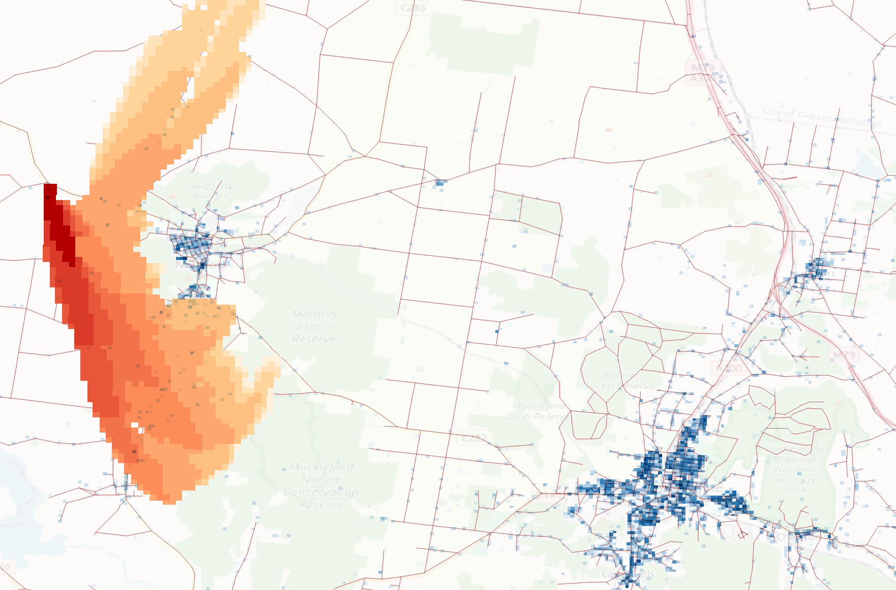

# Evaluating bushfire evacuation models

The purpose of this work is to evaluate different bushfire evacuation models against a set of common community evacuation scenarios. The intent is to keep the inputs to the models the same--or as similar as possible--noting that different models will consume potentially different inputs and formats, run the models on those inputs, and compare the outputs in terms of commonalities and differences.

## Models

The models to be evaluated are:

* Emergency Evacuation Simulator (EES) : https://github.com/agentsoz/ees
* Geostack Steady State Evacuation Model (GSSEM) : https://gitlab.com/geostack/library/-/wikis/Geostack-example:-Steady-state-evacuation-model


## Build

For convenience binary builds of the models are provided in the [`./bin`](./bin) directory.

These were built using the instructions below:
* **EES** is a Java application and complete build instructions (unix) are in the project's continuous integration [Travis script](https://github.com/agentsoz/ees/blob/master/.travis.yml).
* **GSSEM** is a CPP application and build instructions are available for [Linux](https://gitlab.com/geostack/library/-/wikis/Building%20Geostack%20on%20Linux), [macOS](https://gitlab.com/geostack/library/-/wikis/Build-and-run-Geostack-on-macOS), and [Windows](https://gitlab.com/geostack/library/-/wikis/Building%20Python%20packages%20on%20Win64).

## Scenarios

### Castlemaine region evacuation

This scenario is available in [scenarios/mount-alexander-shire/castlemaine-region](scenarios/mount-alexander-shire/castlemaine-region).

In this scenario, which is based on the EES [castlemaine-region-archetypes](https://github.com/agentsoz/ees/tree/master/scenarios/mount-alexander-shire/castlemaine-region-archetypes) scenario, the resident population of Castlemaine region (technically the 2016 Australian census population in statistical areas *Castlemaine SA2* and *Castlemaine Region SA2*) is evacuated in response to a Catastrophic (Code Red) fire to the northwest of Maldon. Details of the original scenario including a video of the simulation run are available [here](https://github.com/agentsoz/ees/blob/master/scenarios/mount-alexander-shire/castlemaine-region-archetypes/README.md#commit-495a7f8--9-sep-2019).

## Converting EES inputs to GSSEM

This can now be done completely using the geostack library (python binding). To get started, ensure that you have a functional geostack environment in conda as per the instructions [here](https://gitlab.com/geostack/library/-/wikis/Building-Python-packages).

Then, from the command line (unix-based, or in the windows linux subsystem), from the current directory do:

```
rm -rf data && python ees2sem.py
```

This will download the Castlemaine Region EES scenario files into a new temporary directory `./data/abm` and then convert them all to gssem compatible inputs in `./data/sem`. The output looks something like below in QGIS:



The script `ees2sem.py` is portable. It can be copied to any functional geostack python environment and should just work out of the box.
