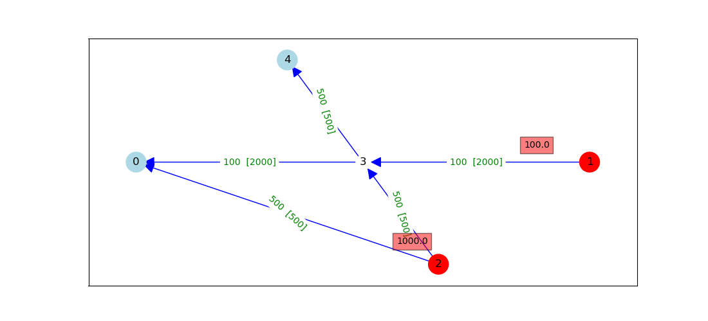
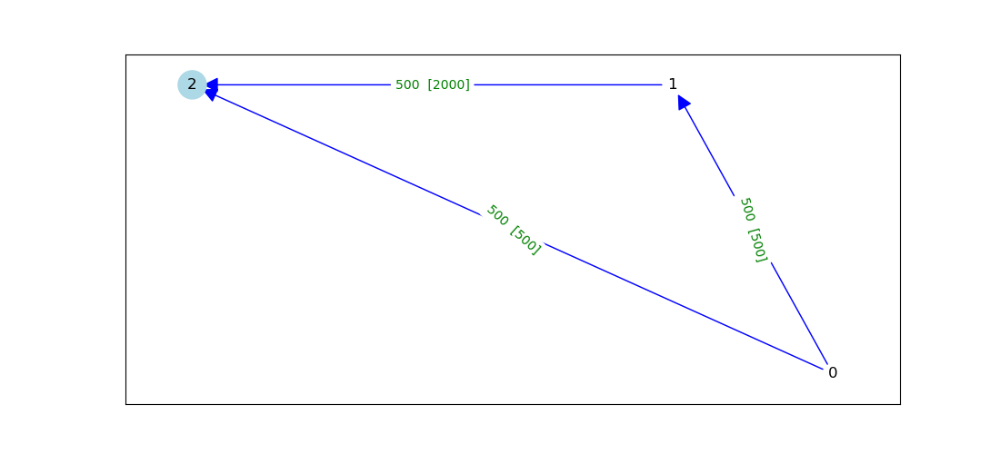
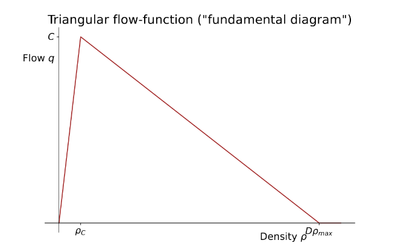
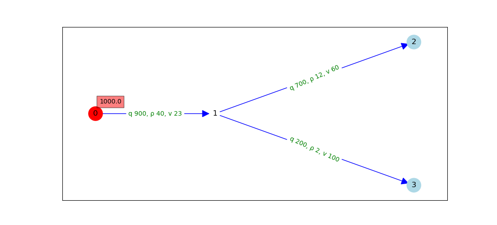
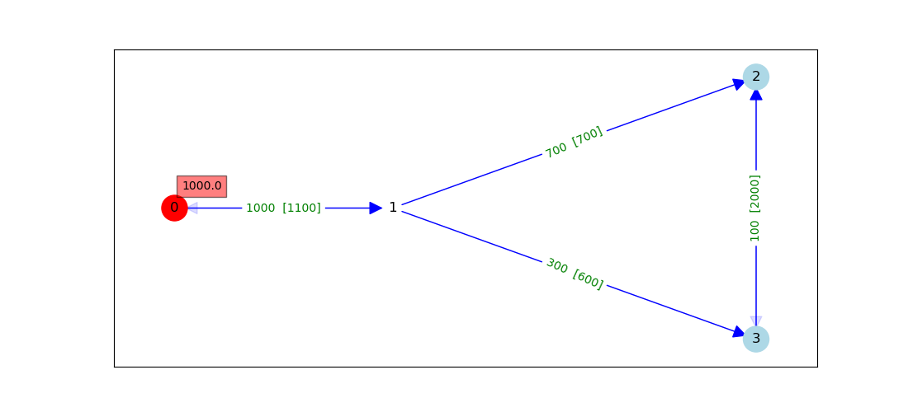

# Overview of static-evacuation models (SEM)

*Aim*: to identify bottlenecks in a road-network and the links that become congested as a consequence of the bottlenecks. Because there are about 10^6 to 10^7 fire-scenarios, each giving rise to an associated sub-network of road-links, the implementation must be fast.

What makes this problem difficult is that flow in a link, and whether that flow is free or congested, affects and depends on the flows and congestion-states in adjacent links, both upstream and downstream, all of which in general are time-dependent.

## Inputs for a scenario
* A network of directed links (arcs) and nodes.
* Each link has a 
  * flow-capacity, 
  * free speed, 
  * length, 
  * number of road-lanes, and 
  * flag to indicate whether the link is one-way or both directions can be used.
* A subset of *injection-nodes,* at each of which there is a specified in-flow of traffic from nearby homes.
* A subset of *exit-nodes* where traffic can flow out of the network.
* Every node is either an injection-node or an exit-node, and not both.
* The in-flow at an injection-node is sub-divided into specified *subflows*, one for each exit-node that has been assigned to that injection-node.

## History of versions of the model

* SEM1 models water-flow and can be implemented as fast code, but its monotonic-flow assumption means congestion does not arise; hence SEM1 can't realistically model traffic-flow.
* SEM2 introduces a non-monotonic hump-shaped flow-function in which flow rises then falls with increasing density; congestion can thereby arise. But having only one variable ("pressure-head") per node overly restricts the allowable flow-configurations, that is, the model disallows reasonable sets of flows.
* SEM3 makes use of established models of traffic-flow dynamics, in which free uncongested flow propagates downstream and bottleneck-induced congestion propagates upstream. Once all downstream-propagating flow-wavefronts have departed at the exit-nodes, the resulting flows yield a static solution. The simplifying assumption is made that congested flow propagates upstream all the way to the injection-nodes, which leads to plausible results only on simple networks.
* SEM4, which with hindsight should perhaps be called SEM3.1, generalises SEM3 to more-complex networks. The hope was that its time-dependent outputs would closely approximate those of the ABM, but the model and implementation are complex, and the implementation is thus far incomplete and would require optimisation to provide acceptable running-time.
* SEM5 was motivated by the need for a model that is not too complex and has a fast implementation; an inherently static model seemed likely to satisfy these requirements, so the maximum-flow method was chosen for computation of flows. A link is considered congested if its flow is close to its capacity. One reason the maximum-flow method is fast is that it relaxes the requirement for flow to take routes that would be plausible for traffic for follow; instead the routes are those that give the maximum-possible total flow out of the network at the exit-nodes.
* Dhirendra Singh created SEM6 (might need a better name), which introduces the context of bush-fire evacuation by defining the injection- and exit-nodes with reference to
  - the fire's perimeter,
  - the population distribution within and just outside the perimeter, and
  - the highest-capacity links near aggregated subsets of population.
SEM6 also calculates, once for each injection-node, the maximum flow assuming that were the only injection-node, then combines the resulting flow-sets over all injection-nodes to provide a revised estimate of each population-node's inflow into the network.

## Comparison of versions of the model

Model | Why currently fails | Advantages | Drawbacks | Improvements (if any) needed to make model work
------ |------------------- |---------- |--------- |------------------------
SEM1  | Each link has infinite flow-capacity, meaning congestion can't arise | Simple to implement; Newton-Raphson method quickly solves model | Congestion can't arise in model, owing to no upper limit on flow through a link |
SEM2  | On at least one network having a solution, model can find no solution. | Quite simple to implement | Global optimiser is slow, and must often be run several times from different starting-vectors; traffic can flow out at any exit-node: can't send a subflow to its assigned exit-node. | Instead of one variable h per node, could try one variable (density) per arc, but without additional constraints the assignment to each arc of free or congested flow would be arbitrary
SEM3  | Implementation is incomplete | Identifies some congested links; sends subflows to their assigned exit-nodes | Upstream propagation of congestion is too crude; model and implementation are complex | Extension to correctly propagate shockfronts through nodes, with resulting downstream effects
SEM4  | Implementation is incomplete | Identifies some congested links; sends subflows to their assigned exit-nodes; reports time- and link-dependent extent of upstream-propagating congestion | Model and implementation are complex; implementation is slow as yet | As for SEM3
SEM5  | | Maximum-flow is implemented in libraries, and code is fast | Provides no information on dynamic evolution of flows; doesn't consider individual subflows between injection/exit pairs, so fails to detect likely congestion along subflows (reports false negatives); version without positive lower bounds on inflows at population-nodes can give zero inflows and therefore infinite evacuation-times | Try applying maximum-flow method to the sub-network containing only links used by assigned subflows
SEM6  | | Injection- and exit-nodes are quickly calculated by making use of pre-processed road-network data; estimates of population-node inflows circumvent problem of infinite evacuation-times. | As for SEM5 | Could potentially improve risk-metrics and method by which estimates of population-node inflows are calculated.

## Versions of the model in more detail

### SEM1 (base version) – hydraulic-based flow through pipes
* Flow-conservation constraint applies at each non-exit node: sum(inflows) = sum(outflows).
* Flow is a monotonic function of head-loss, meaning multivariate Newton-Raphson method can be used to find pressure-head values that imply flows obeying the constraint.
* Flow-capacity in each link is infinite: can obtain an arbitrarily high flow by making the head-loss sufficiently large. This implies congestion never arises.

### SEM2 – hydraulic-based flow through pipes, with varying fluid-density
* Based on SEM1, but a link's head-loss is interpreted as its density: implies flow is density-dependent.
* Flow is a non-monotonic function of density, with a "hump": densities below the hump-density correspond to freely-flowing traffic, densities above it to congested traffic.
* Non-monotonicity of flow means that Newton-Raphson fails: instead must use a global optimiser to find head-values that obey the flow-conservation constraint.
* Each link now has a flow-capacity (the upper bound on its flow-function).

* The five-node network illustrated below, with all links having equal free speed and number of lanes, and assigned subflows of 
  - 100 from node 1 to node 0
  - 500 from node 2 to node 0
  - 500 from node 2 to node 4

has the unique solution shown (flow-capacities in square brackets). But with one h-variable per node, SEM2 cannot find this solution, even if we allow arbitrary h-values at exit-nodes: the two links that leave node 2 both having flows of 500 implies h2-h0 = h2-h3, but then h3-h0 = (h2-h0)-(h2-h3) = 0, implying zero flow from node 3 to node 0.

* Even if subflows are not assigned, SEM2 cannot find a solution satisfying the specified total inflows at nodes 1 and 2 of 100 and 1,000 respectively: if the total inflow of 1,000 at node 2 enters the network, then by the above argument, flow from node 3 to node 0 must be zero in SEM2. (This might be more easily seen if nodes 1 and node 4 are removed.)
* Could seek to improve model by replacing h-variables at nodes with one density-variable per arc, but then the model wouldn't be able to choose on each link between low (free) and high (congested) densities, so there would be at least 2^|E| distinct solutions and the model wouldn't reliably report congestion: would need additional constraints to enforce relationships between adjacent links' densities.

* Update: the three-node network illustrated below, with all links having equal free speed and number of lanes, and an inflow of 1,000 vehicles per hour at the injection-node 0, has the unique flows-solution (q01, q02, q12) shown (flow-capacities in square brackets). 
Because the flow in link (0,1) equals the link's capacity of 500, then if SEM2 can admit this solution it must be that h0 - h1 is equal to the density rhoC_01 that achieves capacity flow (see diagram below of the triangular flow-function). The same argument applied to link (0,2) shows that h0 - h2 is equal to rhoC_02. But these two links have the same capacity, free speed, and number of lanes, which implies rhoC_01 = rhoC_02. 
Therefore h0-h1 = h0-h2, but then h1-h2 = (h0-h2)-(h0-h1) = 0, implying zero flow from node 1 to node 2; hence there is no way for SEM2 to allow flows of 500 on all three links.

### SEM3 - traffic-flow along road-links: congestion results from insufficient capacity downstream
* Models traffic flowing downstream and encountering a link of insufficient capacity, so that links upstream of the bottleneck can be identified as congested.
* Traffic entering at an injection-node takes a shortest-path route to each of its assigned exit-nodes.
* Theory taken from Chapter 8 of Treiber & Ketting, *Traffic Flow Dynamics* (2013).
* Piece-wise linear 'triangular' flow-function gives speed and density within each link: has two pieces, corresponding to free and congested flow.

* Traffic-flow is divided into distinct ''zones'', each with constant values for flow, density, and speed; the zones' boundaries are wavefronts that propagate with time. A link can contain several zones, or just one.
* Free flow propagates downstream as a wavefront, with propagation-speed equal to the free speed of its current link.
* If a free-flow wavefront reaches a link with insufficient capacity to carry its flow, then congested flow is assumed to back up, i.e. propagate upstream, all the way to the injection-nodes.

* Once all downstream-propagating wavefronts have departed the network, the resulting flows on links give a static solution.

### SEM4 - traffic-flow along road-links, with time-dependent upstream-propagating congestion
* Essentially a dynamic model, as the wavefronts' positions are updated through time. The simulation has a specified duration (in hours), which if set sufficiently long gives a static solution.
* Congested flow backs up through time as a ''shockfront'' (upstream-propagating wavefront).
* A shockfront can catch up with a slower-propagating shockfront, or meet a downstream-propagating wavefront, on the same link.
* The next time-step is defined as the shortest elapsed time until a wavefront reaches the end of its link or intersects with another wavefront on that link.
* Can indicate differing extents of congestion in links by reporting each link's time-averaged flow, i.e. the cumulative number of vehicles (in general a floating-point value) to have departed the link during the simulation, divided by the simulation's duration.

### SEM5 - detect congestion by finding the network's maximum flow
* Reports the maximum-possible flow through network, using supplies and demands derived from the assigned subflows from injection- to exit-nodes; reports links that attain their flow-capacity at maximum flow.
* If the maximum flow is less than total of assigned subflows, then congestion on at least some links is unavoidable.
* Maximum-flow method doesn't consider individual subflows between origin/destination pairs, so congestion along subflow-paths is possible even when the maximum flow equals total of assigned subflows; consider the network below (flow-capacities in square brackets), with assigned subflows of 
  - 800 from node 0 to node 2
  - 200 from node 0 to node 3.
When the subflows use only links on shortest paths, which exclude arc (2,3), there is congestion on arc (0,1):

Maximum-flow method finds maximum flow (1000) equal to the total of assigned subflows, but this flow is achieved only by using arc (2,3) - a false negative:

* This problem might be alleviated by calculating maximum flow on the sub-network that contains only links carrying assigned subflows.

## Next steps for development
* Complete implementation of SEM3/4 to correctly propagate congested flow upstream.
* Optimise SEM3/4 to obtain an improved time-complexity, which is currently as high as O(E N^4).
* Modify SEM5 to find maximum flow through the sub-network containing only links used by assigned subflows.

## Authors of software-implementations
* **James Hilton** - *SEM1*
* **Stephen Taylor** - *Generalisation of SEM1 to SEM2, implementation of SEM3/4 and SEM5*
