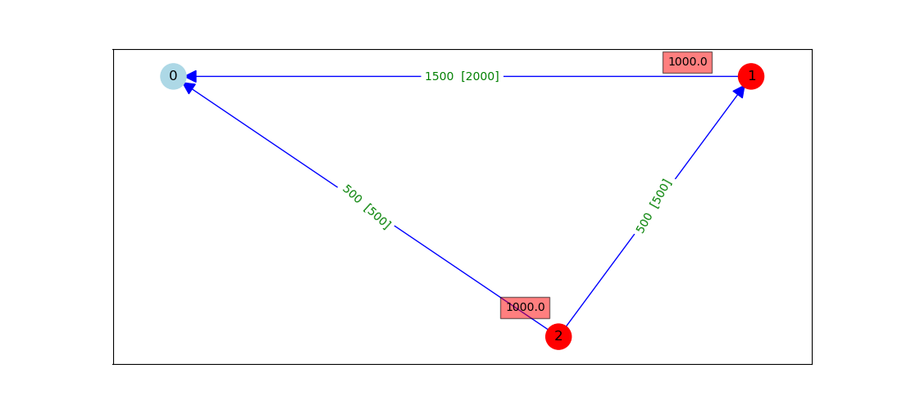

# Overview of static-evacuation models (SEM)

## Inputs for a scenario
* A network of links (edges) and nodes.
* Each link has a 
  * flow-capacity, 
  * free speed, 
  * length, 
  * number of road-lanes, and 
  * flag to indicate whether the link is one-way or both directions can be used.
* A subset of *injection-nodes,* at each of which there is a specified in-flow of traffic from nearby homes.
* A subset of *exit-nodes* where traffic can flow out of the network.
* Every node is either an injection-node or an exit-node, and not both.
* The in-flow at an injection-node is sub-divided into specified subflows, one for each exit-node that has been assigned to that injection-node.

## Comparison of versions of the model

Model | Why currently fails | Advantages | Drawbacks | Improvements (if any) that could make model work
------ |------------------- |---------- |--------- |------------------------
SEM1  | Each link has infinite flow-capacity, so congestion can't arise | Simple to implement; Newton-Raphson method quickly solves model | Doesn't adequately model traffic-flow |
SEM2  | Traffic can flow out at any exit-node: can't send a subflow to its assigned exit-node. Model has no way to choose between low (free-flow) and high (congested) density in each link, so can't detect congestion | Simple to implement | Doesn't adequately model traffic-flow; global optimiser is slow | Instead of one variable h per node, could try one variable (density) per arc, but assignment to each arc of free or congested flow would still be arbitrary
SEM3  | Implementation is incomplete | Identifies congested links, sends subflows to their assigned exit-nodes; completes quickly, so far | | Extension to correctly propagate shockfronts through nodes
SEM4  | Implementation is incomplete | Sends subflows to their assigned exit-nodes; reports time-dependent propagation of wavefronts | Model and implementation are complex | Extension to correctly propagate shockfronts through nodes
SEM5  | If capacities allow, maximum-flow method correctly sends total assigned flow from each injection-node and total assigned flow to each exit-node; but doesn't satisfy individual subflows between origin/destination pairs | Maximum-flow is implemented in libraries, and code is fast | Doesn't consider individual subflows between injection/exit pairs, so misses congestion along subflows | Apply method to the sub-network containing only links used by assigned subflows

## Versions of the model in more detail

### SEM1 (base version) – hydraulic-based flow through pipes
* Flow-conservation constraint applies at each non-exit node: sum(inflows) = sum(outflows).
* Flow is a monotonic function of head-loss, meaning multivariate Newton-Raphson method can be used to find pressure-head values that imply flows obeying the constraint.
* Flow-capacity in each link is infinite: can obtain an arbitrarily high flow by making the head-loss sufficiently large. 

### SEM2 – hydraulic-based flow through pipes, with varying fluid-density
* Based on SEM1, but a link's head-loss is interpreted as its density: implies flow is density-dependent.
* Flow is a non-monotonic function of density, with a "hump": densities below the hump-density correspond to freely-flowing traffic, densities above it to congested traffic.
* Non-monotonicity of flow means that Newton-Raphson fails: instead must use a global optimiser to find head-values that obey the flow-conservation constraint.
* Each link now has a flow-capacity (the upper bound on its flow-function).
* The three-node network illustrated below, with two injection-nodes, one exit-node, and assigned subflows of 
  - 1000 from node 1 to node 0
  - 1000 from node 2 to node 0

has the unique solution shown (flow-capacities in square brackets). But with one h-variable per node, SEM2 cannot find this solution, even if we allow arbitrary h-values at exit-nodes: two links with flows of 500 implies h2-h0 = h2-h1, but h2-h0 = (h2-h1)+(h1-h0) > h2-h1, a contradiction.

* Could improve by replacing h-variables at nodes with one density-variable per arc, but the model still wouldn't be able to choose between free and congested densities, so there would be at least 2^|E| distinct solutions and the model wouldn't reliably report congestion.

### SEM3 - traffic-flow along road-links, with flow dependent on density
* Models the way traffic can encounter a link of insufficient capacity, so that congested links are identified
* Theory taken from Chapter 8 of Treiber & Ketting, *Traffic Flow Dynamics* (2013).
* Use piece-wise linear ''triangular'' flow-function: has two pieces, corresponding to free and congested flow, respectively (and is non-monotonic in density).
* The triangular flow-function 
* Traffic entering at any injection-node takes its shortest-path route to the nearest exit-node.
* Traffic-flow is divided into distinct ''zones'', each with constant values for flow, density, and speed; the zones' boundaries are wavefronts that propagate with time. A link can contain several zones, or just one.
* Free flow propagates downstream as a wavefront, with propagation-speed equal to the free speed of its current link.
* If a free-flow wavefront reaches a link with insufficient capacity to carry its entire flow, then congested flow propagates upstream as a ''shockwave'' (upstream-propagating wavefront).

* A shockwave can catch up with a slower-propagating shockwave, or meet a downstream-propagating wavefront, on the same link.
* The next time-step is defined as the shortest elapsed time until a wavefront reaches the end of its link or intersects with another wavefront on that link.
* For the static solution at time infinity, all shockwaves are assumed to have propagated upstream to the root-nodes of the shortest-path tree.

### SEM4 - traffic-flow along road-links, with flow dependent on density
* Not really a static model, as the wavefronts' positions are updated through time. The simulation has a specified duration (in hours).
* The flow through each link is calculated as the cumulative number of vehicles (in general a floating-point value) that have departed the link at its downstream end at some point during the simulation, divided by the simulation's duration.

### SEM5 - detect congestion by finding maximum-possible traffic-flow through the network of road-links
* Reports the maximum-possible flow through network based on assigned subflows from injection- to exit-nodes; also reports links that attain their flow-capacity at maximum flow
* If the maximum flow is less than total of assigned subflows, then congestion on on at least some links is unavoidable
* Maximum-flow method doesn't consider individual subflows between origin/destination pairs, so congestion along subflow-paths is possible even when the maximum flow equals total of assigned subflows; consider the network below (flow-capacities in square brackets), with assigned subflows of 
  - 800 from node 0 to node 2
  - 200 from node 0 to node 3.
When the subflows use only links on shortest paths, which exclude arc (2,3), there is congestion on arc (0,1):

Maximum-flow method finds maximum flow (1000) equal to the total of assigned subflows, but is achieved only by using arc (2,3) - a false negative:

* This problem might be alleviated by calculating maximum flow on the network that contains only links carrying assigned subflows.

## Next steps for development
* Complete implementation of SEM3/4 to send each traffic subflow between its assigned injection-node and exit-node, and to correctly propagate congested flow upstream.
* Perhaps optimise SEM3/4 to obtain an improved time-complexity, which is currently as high as O(E N^4).

## Authors of software-implementations
* **James Hilton** - *SEM1*
* **Stephen Taylor** - *Generalisation of SEM1 to SEM2, implementation of SEM3/4 and SEM5*
