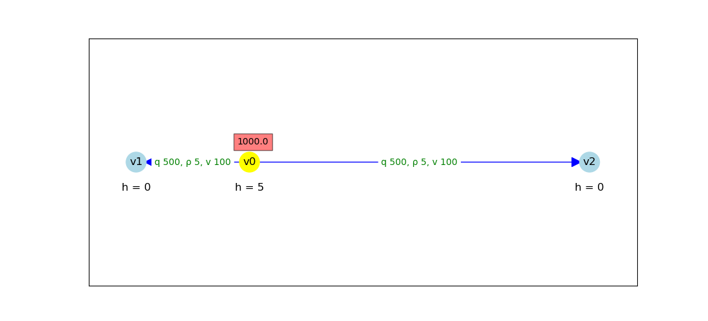
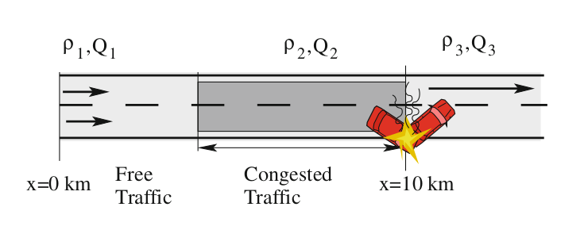

# Overview of static-evacuation models (SEM)

## Inputs for a scenario
* A network of nodes and edges
* Each edge has a flow-capacity, free speed, and number of lanes
* A subset of ''injection-nodes,'' at each of which there is a specified in-flow of traffic
* A subset of ''exit-nodes'' where the traffic can flow out of the network.
* Every node is either an ''injection-node'' or an ''exit-node,'' and not both.

## Versions of the model

### SEM1 (base version) – hydraulic-based flow through pipes
* Constraint: flow is conserved at every node: sum(inflows) = sum(outflows).
* Flow is a monotonic function of head-loss, meaning multivariate Newton-Raphson method can be used to find head-values that obey the constraint.
* Flow is proportional to pipe-diameter, but pipe-diameter doesn't constrain capacity: can obtain an arbitrarily high flow in a link by making the head-loss sufficiently large. 

### SEM2 – hydraulic-based flow through pipes, with varying fluid-density
* Based on SEM1, but a link's head-loss is interpreted as its density: implies that flow is density-dependent.
* Flow is a non-monotonic function of density, with a "hump": densities below the hump-density correspond to freely-flowing traffic, densities above it to congested traffic.
* Non-monotonicity of flow means that Newton-Raphson fails: instead must use a global optimiser to find head-values that obey the flow-conservation constraint.
* Each link now has a flow-capacity (the upper bound on its flow-function).
* Link-lengths play no role, so traffic can take unlikely routes to the exit-nodes: this makes false negatives possible, when the model doesn't find a route, likely taken in reality, that would give rise to congestion.
* The simple three-node network with one injection-node can provide a false negative: if the righthand link is long relative to the lefthand link, then no traffic in reality would choose to travel down it, yet the model predicts that densities on the two links are equal. Hence if the lefthand link is not sufficiently capacious to take all inflowing traffic without congestion, yet both links together can take all traffic without congestion, then the model will report a solution with no congestion even though, in reality, all traffic would likely travel to the left and becomes congested.

### SEM3 - traffic-flow along road-links, with flow dependent on density
* Theory taken from Chapter 8 of Treiber & Ketting, *Traffic Flow Dynamics* (2013).
* Use piece-wise linear ''triangular'' flow-function: has two pieces, corresponding to free and congested flow, respectively (and is non-monotonic in density).
* The triangular flow-function 
* Traffic entering at any injection-node takes its shortest-path route to the nearest exit-node.
* Traffic-flow is divided into distinct ''zones'', each with its own values for flow, density, and speed; the zones' boundaries are wavefronts that propagate with time. A link can contain several zones, or just one.
* Free flow propagates downstream as a wavefront, with propagation-speed equal to the free speed of its current link.
* If a free-flow wavefront reaches a link with insufficient capacity to carry its entire flow, then congested flow propagates upstream as a ''shockwave'' (upsteram-propagating wavefront). 

* A shockwave can catch up with a slower-propagating shockwave, or meet a downstream-propagating wavefront, on the same link.
* Each time-step is defined as the time it will take for the next wavefront to reach the end of its link or intersect with another wavefront on that link.
* For the static solution at time infinity, all shockwaves are assumed to have propagated upstream to the root-nodes of the shortest-path tree.

### SEM4 - traffic-flow along road-links, with flow dependent on density
* Not really a static model, as the wavefronts' positions are updated through time. The simulation has a specified duration (in hours).
* The flow through each link is calculated as the cumulative number of vehicles (in general a floating-point value) that have departed the link at its downstream end at some point during the simulation, divided by the simulation's duration.

## Next steps for development
* Generalise SEM3/4 to allow some traffic-flow at an injection-node to head for one exit-node while the remaining flow heads for another exit.
* Perhaps optimise SEM3/4 to obtain an improved time-complexity, which is currently as high as O(E N^4).

## Authors of software-implementations
* **James Hilton** - *SEM1*
* **Stephen Taylor** - *Generalisation of SEM1 to SEM2, implementation of SEM3 and SEM4* 
