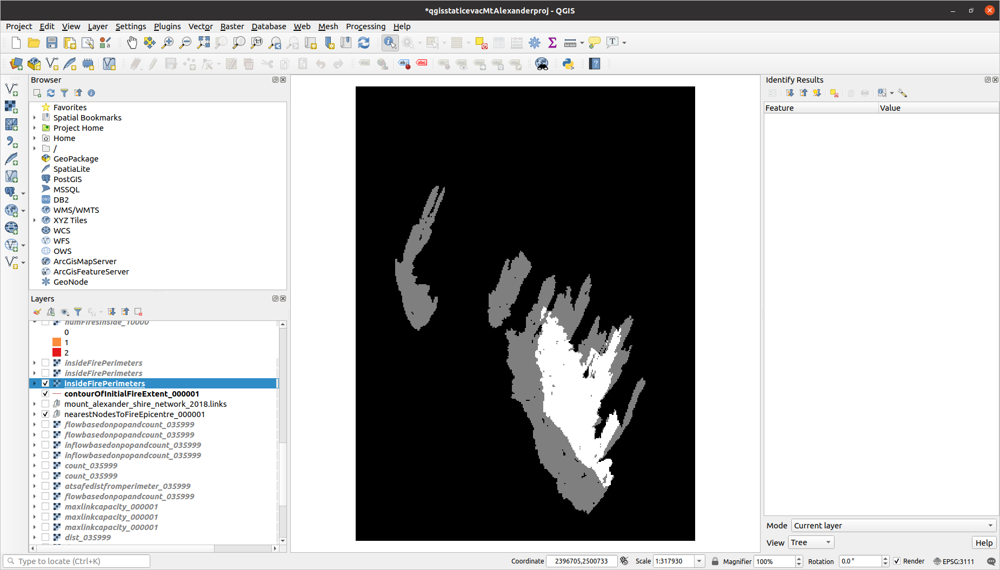
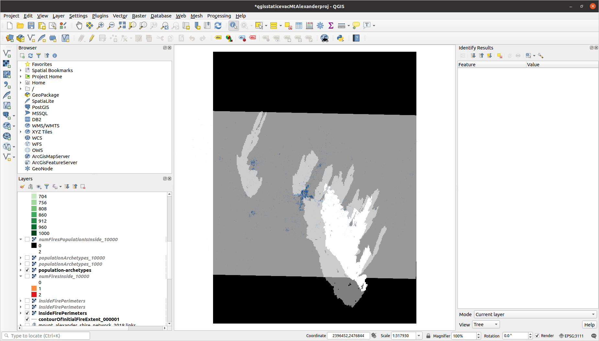
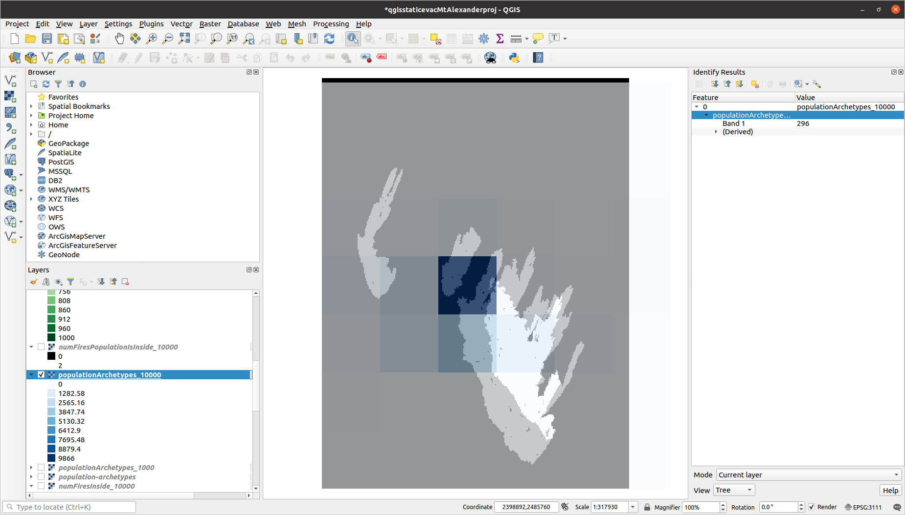
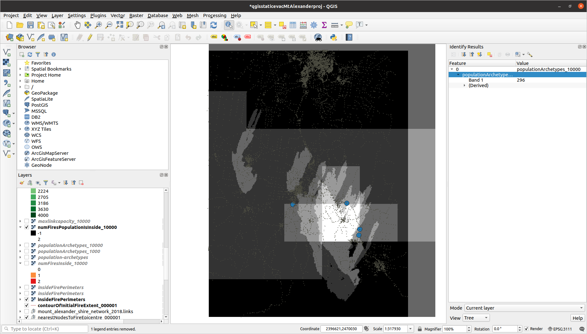
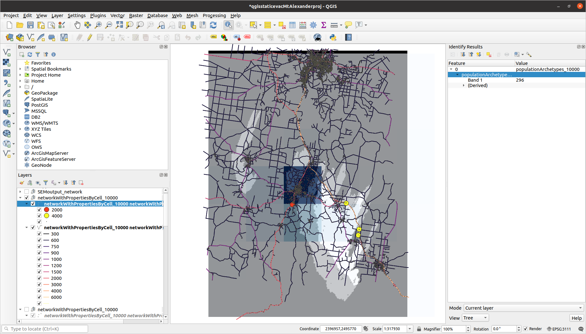
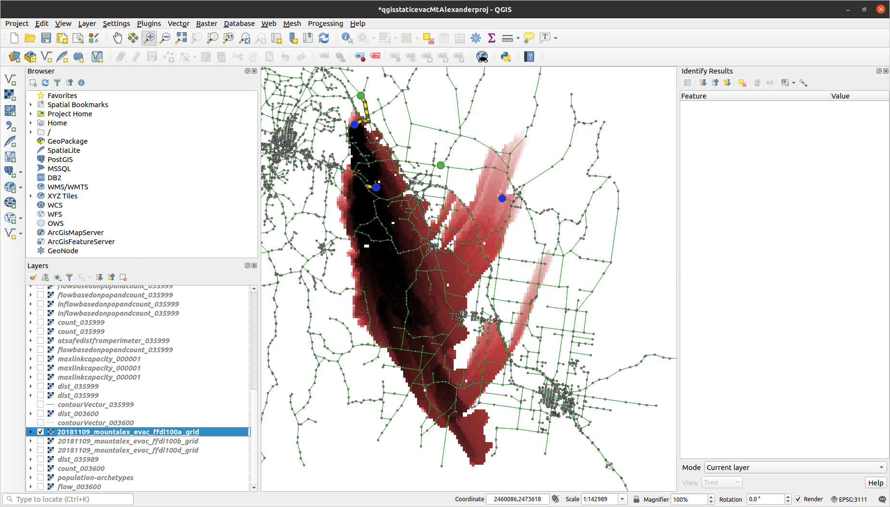
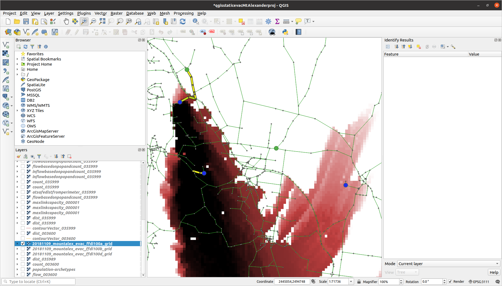
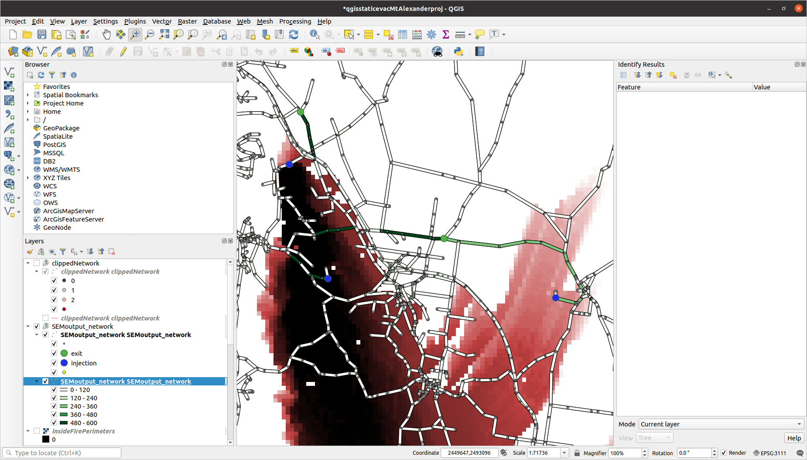

# Community risk per population-node, as posed by four fires (Mount Alexander Shire)

# Each population raster-cell inside at least one fire is assigned an injection-node - the network node having largest maximum out-capacity

# Maximum-flow method run on fire ffdi100a

