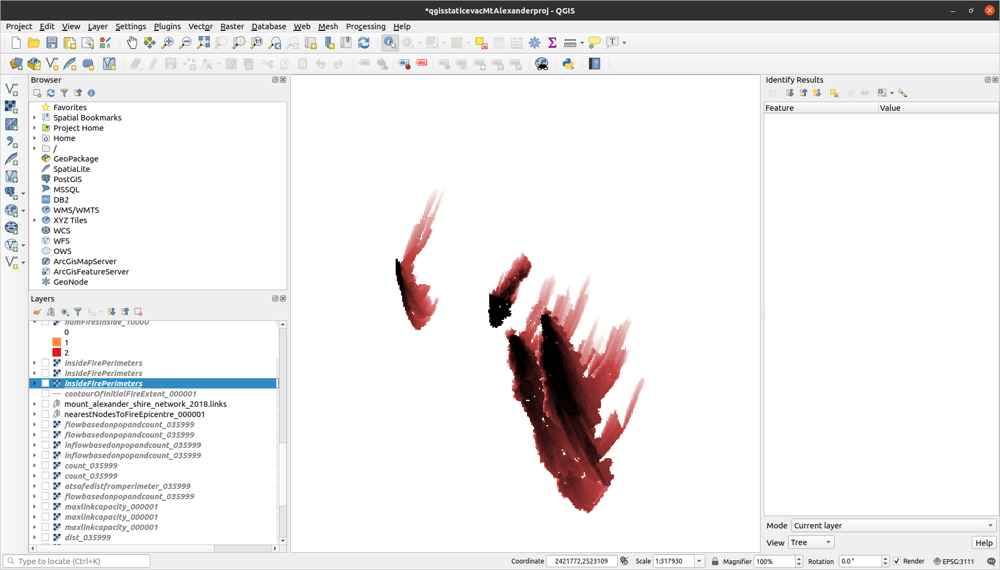

# Community risk per population node, as posed by four fires (Mount Alexander Shire)

### Population archetypes superimposed:

### Population as a coarser-grained raster:

### Number of fires each population-cell sits inside (community risk)

# Maximum-flow method run on fire ffdi100a

## Each population raster-cell with non-zero population and inside the fire is assigned a "population node" (injection-node) - the network node having largest maximum out-capacity

### Links coloured by capacity and population nodes coloured by largest maximum out-capacity:

### Each population node that's inside at least one fire, its raster-cell coloured by the number of fires it sits inside:

