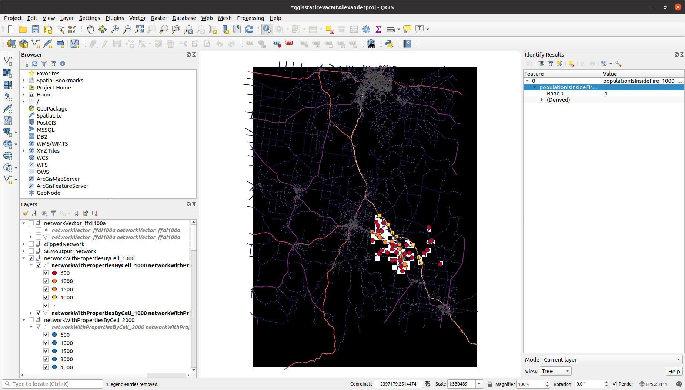

# Community risk per population node, as posed by four fires (Mount Alexander Shire)

### Population archetypes superimposed:

### As a coarser-grained raster:

### Number of fires each population-cell sits inside (community risk)

# Maximum-flow method run on fire ffdi100a

### Inside the fire-perimeter (road-links coloured by capacity):

### Non-zero population inside the fire:

## Each population raster-cell with non-zero population and inside the fire is assigned a "population node" (injection-node) - the network node having largest maximum out-capacity

### Population nodes coloured by largest maximum out-capacity:

### "Safe" area surrounding fire:

### Define exit-nodes as network-nodes that are both in the "safe" buffer-area and close to population?
