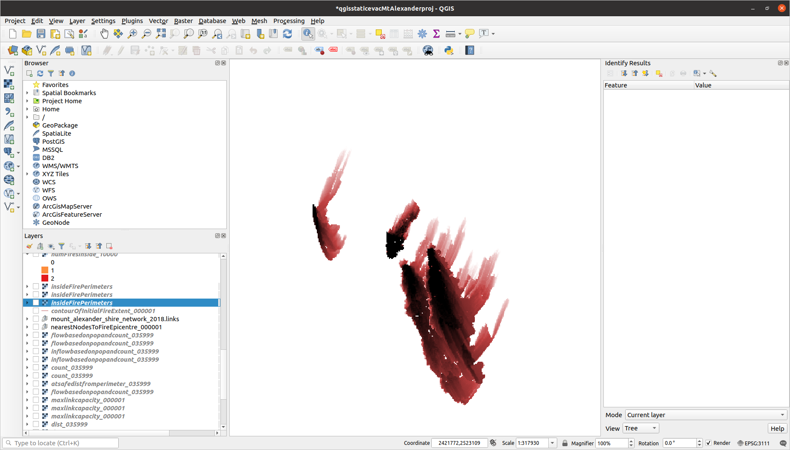
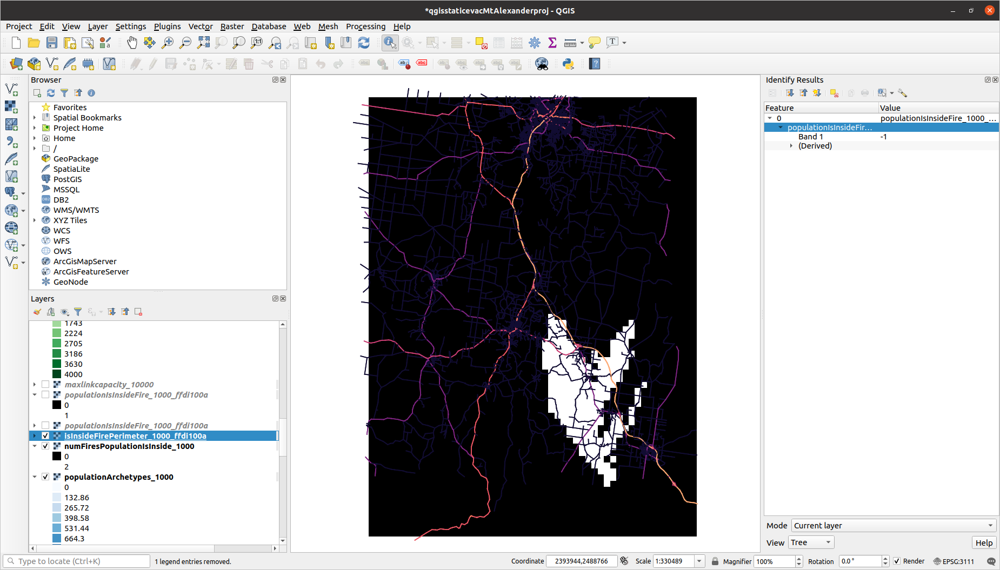
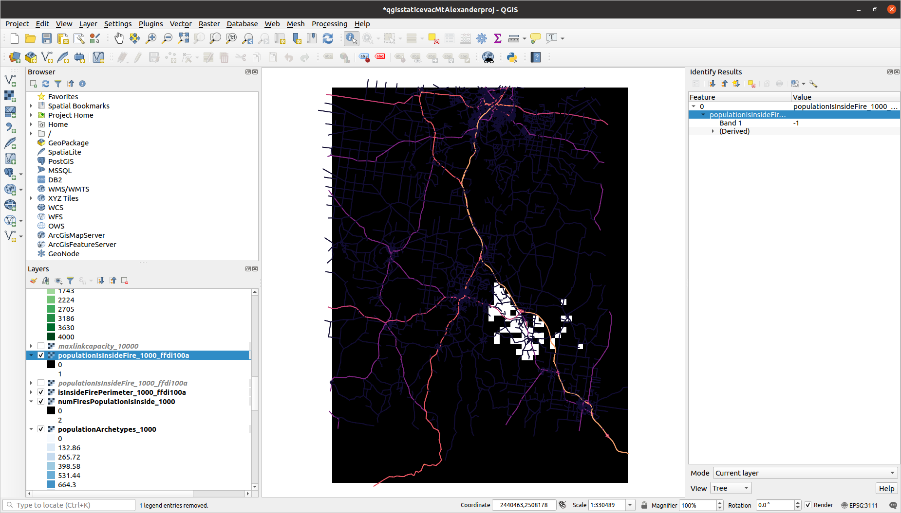
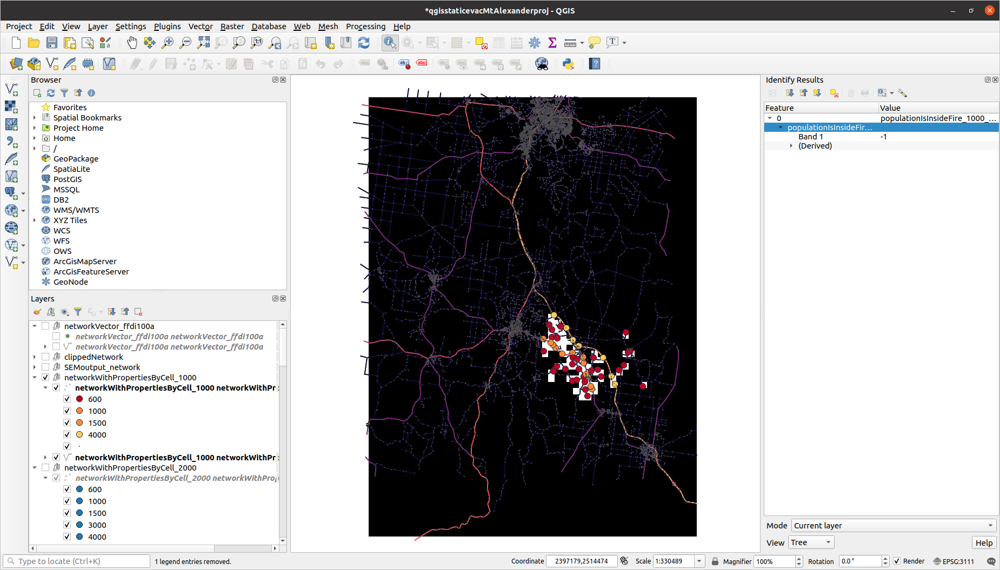
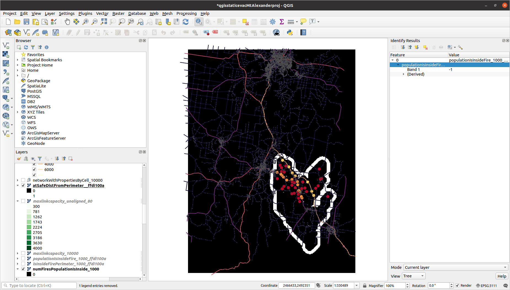
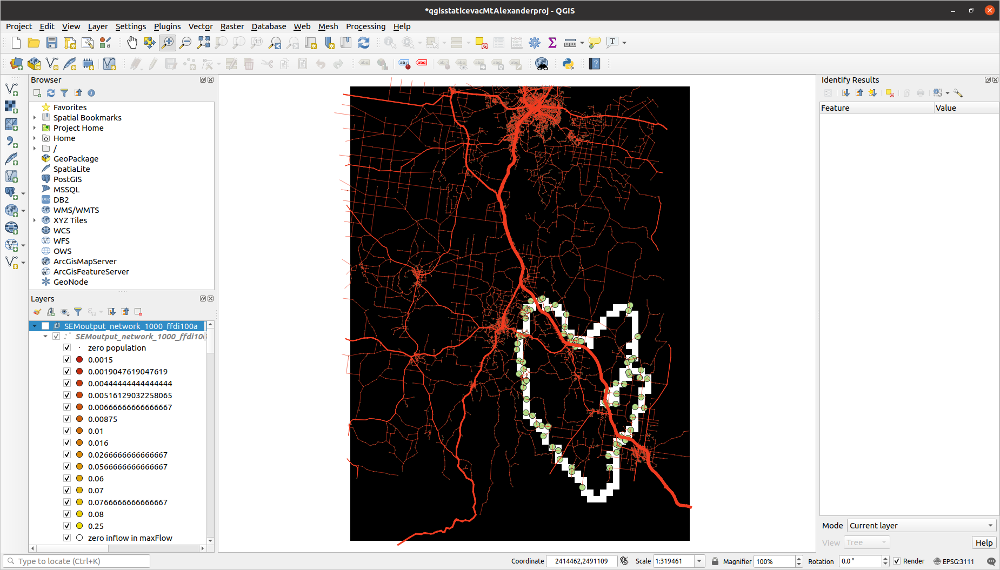
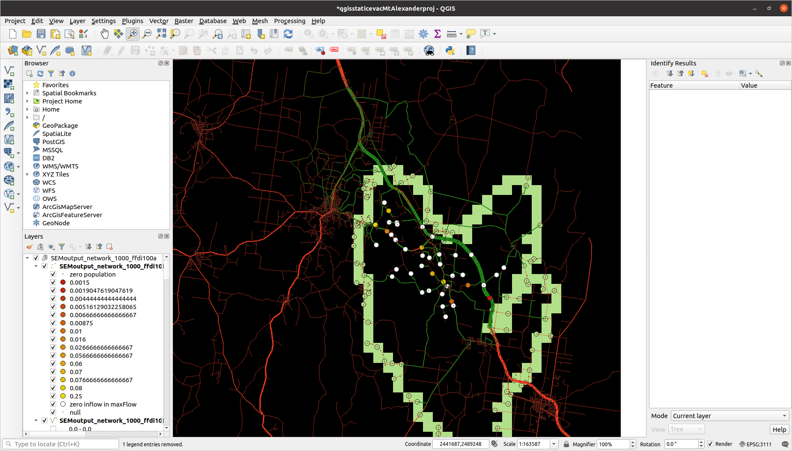
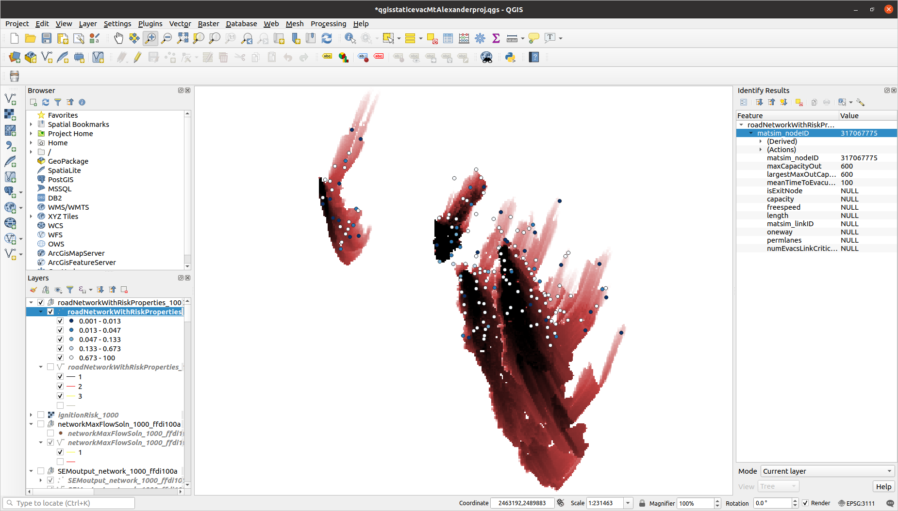
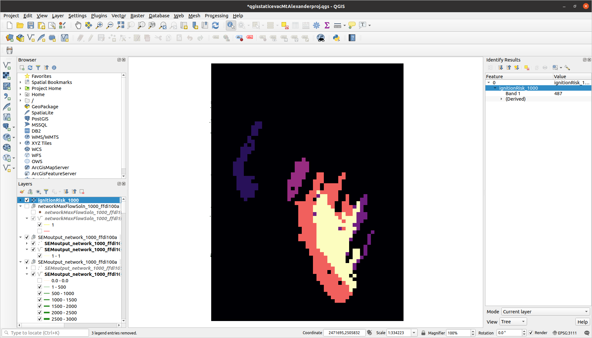
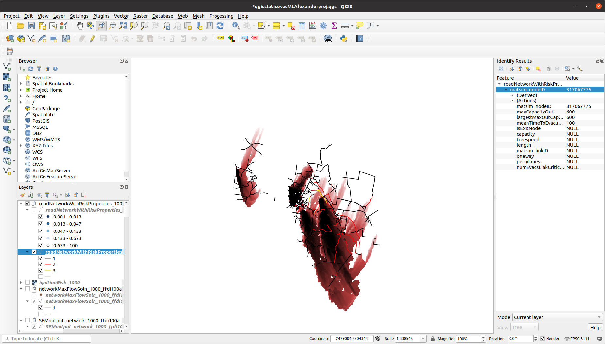

# Risks posed by four fires (Mount Alexander Shire)

### Population archetypes superimposed:

# Maximum-flow method run on fire ffdi100a

### Inside the fire-perimeter (road-links coloured by capacity):

### Non-zero population inside the fire:

## Each population raster-cell with non-zero population and inside the fire is assigned a "population node" (injection-node) - the network node having largest maximum out-capacity

### Population nodes coloured by largest maximum out-capacity:

### "Safe" area surrounding fire:

### Define exit-nodes as network-nodes lying in the "safe" buffer-area (thickness of a road-link indicates capacity):

### Maximum-flow solution (thickness of a green link indicates flow; population nodes coloured by evaucation-time):

# The three types of evacuation risk, measured across all four fires

## Community risk per population node (mean time taken to evacuate node, over all fires that contain it within their perimeters):

## Ignition risk per fire (number of population nodes plus number of critical links within fire-perimeter):

## Point-of-impact risk per link (number of evacuation-flows the link is critical to, over all fires):

